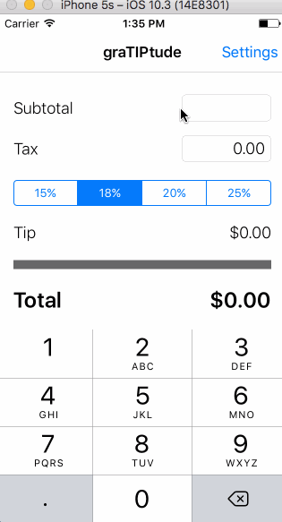

# Pre-work - graTIPtude

graTIPtude is a tip calculator application for iOS.

Submitted by: Angela Yu

Time spent: 15 hours spent in total

## User Stories

The following **required** functionality is complete:

* [x] User can enter a bill amount, choose a tip percentage, and see the tip and total values.
* [x] Settings page to change the default tip percentage.

The following **optional** features are implemented:
* [ ] UI animations
* [x] Remembering the bill and tax amount across app restarts (if <10mins) *(for demo, if < 5secs)*
* [ ] Using locale-specific currency and currency thousands separators.
* [x] Making sure the keyboard is always visible and the bill amount is always the first responder. This way the user doesn't have to tap anywhere to use this app. Just launch the app and start typing.

The following **additional** features are implemented:
* [x] Layout resizes for different device sizes
* [x] Splitting the bill with up to 8 people
* [x] Requesting from or paying to fellow diners the share amount via Venmo
* [ ] Graceful handling if user does not have Venmo app installed (redirect to app store)
* [ ] Text recognition through camera view of the bill

### Additional Features Commentary
1. My original goal for an additional feature was to add a camera button to perform **text recognition** on the receipt. This was done by using the [Tesseract OCR for iOS](https://github.com/gali8/Tesseract-OCR-iOS) library, but I ran into problems when trying to run the app on my actual device to use the camera.  I figured out I need to use the development version instead of the recommended release, so I will try again if I have time.

2. Adding **Venmo** was a workaround. Venmo has closed its API to new apps, so instead I had to use [undocumented deep links](https://blog.alexbeals.com/posts/venmo-deeplinking) to trigger opening the Venmo app and pre-populating it with the amount to request or pay. Thankfully the deep links worked!

## Video Walkthrough 

Here are walkthroughs of implemented user stories:

| v1 walkthrough | v2 walkthrough |
|:----:|:----:|
|  |  |

GIFs created with [LiceCap](http://www.cockos.com/licecap/).

## Project Analysis

As part of your pre-work submission, please reflect on the app and answer the following questions below:

**Question 1**: "What are your reactions to the iOS app development platform so far? How would you describe outlets and actions to another developer? Bonus: any idea how they are being implemented under the hood? (It might give you some ideas if you right-click on the Storyboard and click Open As->Source Code")

**Answer:** Xcode makes iOS app development quite easy; even the bulk of the source code is hidden so the developer can focus on just the custom functionality. However, I find the layout constraints to be cumbersome to set up. The GUI tools for managing layout stack and constraints are clumsy, and auto-layout/suggested defaults aren't reliable enough. I feel compelled to define layout in code to ensure that the UI elements behave optimally for all generations of iPhone.

Outlets are a means of gathering dynamic data from the UI such as user inputs, and Actions are functions to act on data and update the UI during runtime. Each outlet has a destination and a unique ID, as does each action. They are implemented as connections tying UI elements to the ViewController code.

**Question 2**: "Swift uses [Automatic Reference Counting](https://developer.apple.com/library/content/documentation/Swift/Conceptual/Swift_Programming_Language/AutomaticReferenceCounting.html#//apple_ref/doc/uid/TP40014097-CH20-ID49) (ARC), which is not a garbage collector, to manage memory. Can you explain how you can get a strong reference cycle for closures? (There's a section explaining this concept in the link, how would you summarize as simply as possible?)"

**Answer:** A strong reference cycle can occur wtih a closure in an instance for a class if the closure captures the instance itself. This commonly happens when a closure will need to access a property or method of the instance. When an instance is initalized, you assign a strong reference to the closure. If the closure accesses a property or method from the instance, it forms a strong reference back to the instance. These two strong references will then keep the instance and the closure alive; since the reference count for each is at least '1', ARC cannot free up the memory for that instance or the closure.

## License

    Copyright 2017 Angela Yu

    Licensed under the Apache License, Version 2.0 (the "License");
    you may not use this file except in compliance with the License.
    You may obtain a copy of the License at

        http://www.apache.org/licenses/LICENSE-2.0

    Unless required by applicable law or agreed to in writing, software
    distributed under the License is distributed on an "AS IS" BASIS,
    WITHOUT WARRANTIES OR CONDITIONS OF ANY KIND, either express or implied.
    See the License for the specific language governing permissions and
    limitations under the License.
